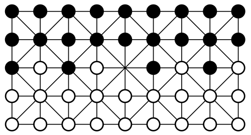
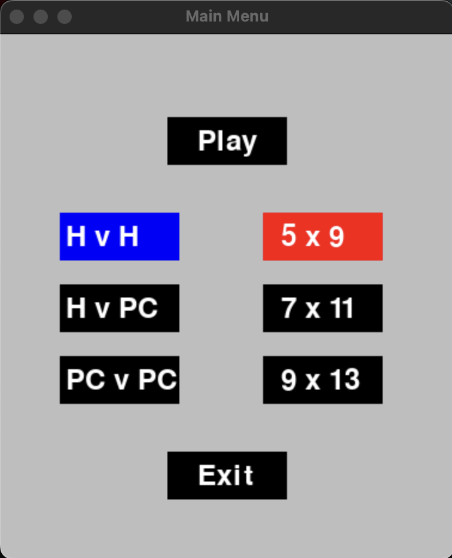
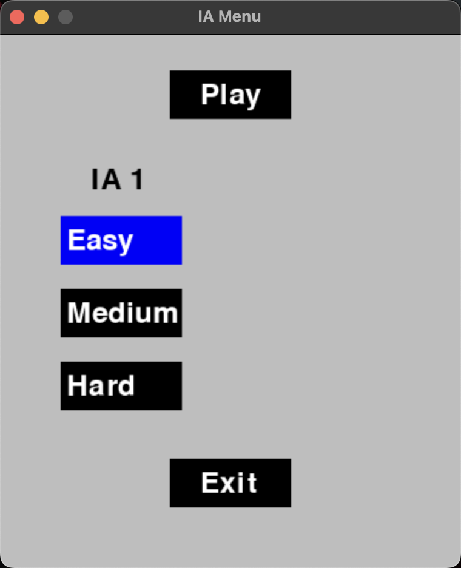
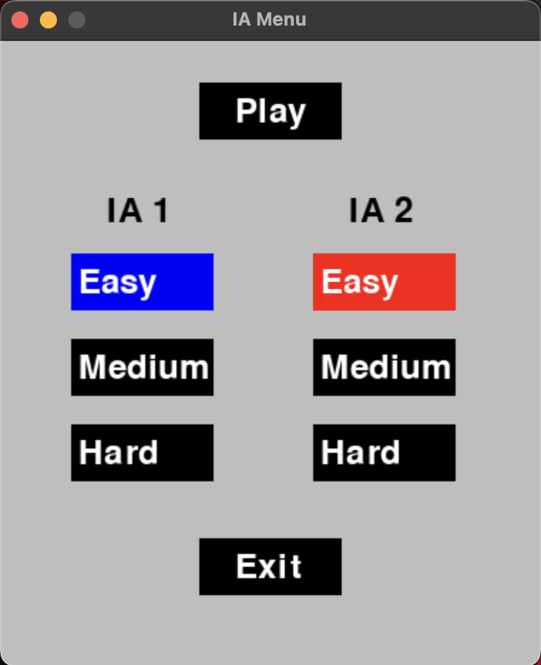
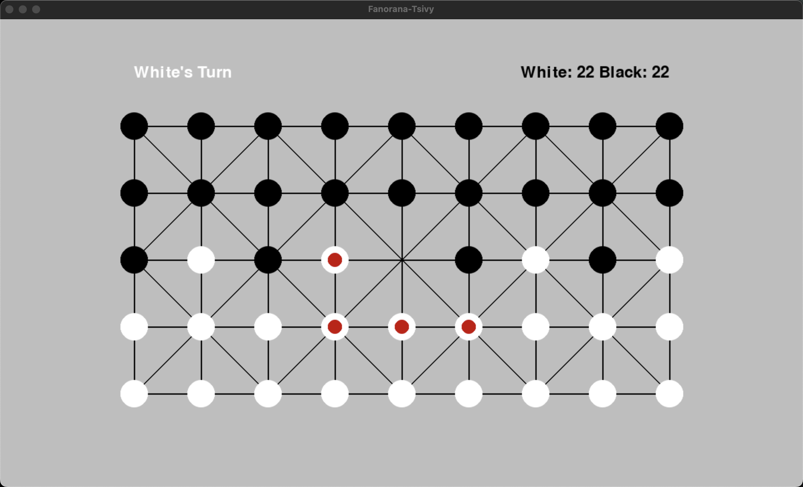
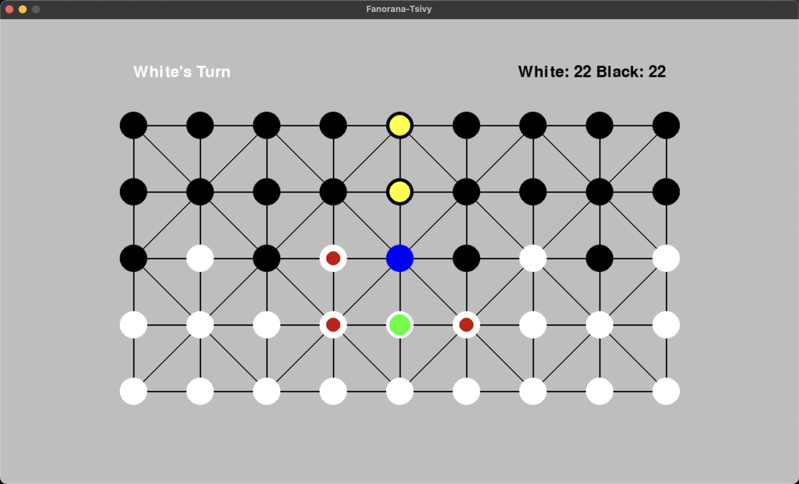
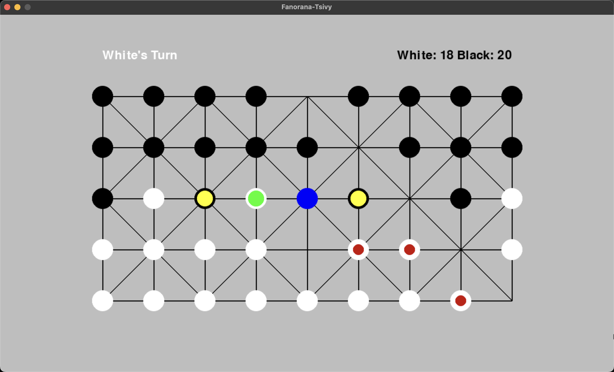
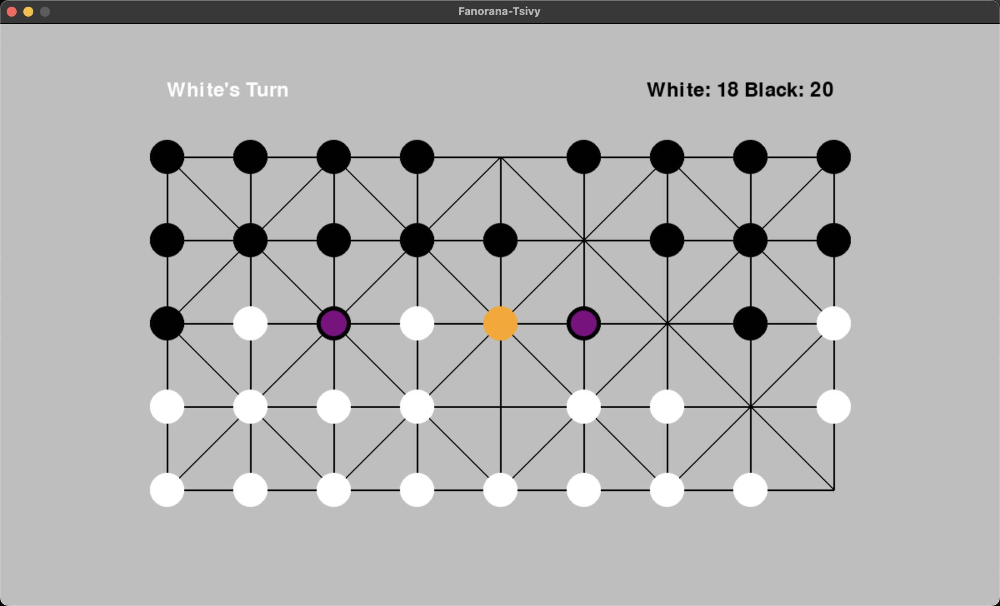
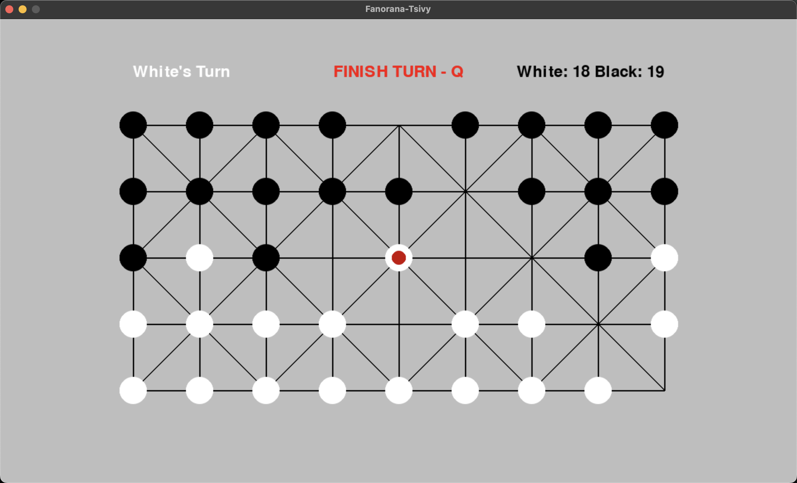

# Fanorona-Tsivy

## Game Definition

Fanorona is a 2 player board game in which the board consists of lines and intersections. A line represents the path along which a stone can move during the game.

There are weak and strong intersections. At a weak intersection it is only possible to move a stone horizontally and vertically, while on a strong intersection it is also possible to move a stone diagonally. Note that a stone can only move from one intersection to an adjacent intersection.

Black and white pieces are arranged on all points but the center.



The objective of the game is to capture all the opponents pieces and the game is a draw if neither player succeeds in this. Players alternate turns, starting with White.

There are two kinds of moves: non-capturing (aka paika move) and capturing. A paika move consists of moving one stone along a line to an adjacent intersection and not capturing any of the opponents stones. Capturing moves are mandatory and have to be played rather than paika moves. Capturing implies removing one or more pieces of the opponent, in one of two ways:
- Approach—moving the capturing stone to a point adjacent to an opponent's stone, which must be on the continuation of the capturing stone's movement line.
- Withdrawal—the capturing stone moves from a point adjacent to the opponent's stone, away from the stone along the continuation of the line between them.

When an opponent stone is captured, all opponent pieces in line beyond that stone (as long as there is no interruption by an empty intersection or a stone of your own in between) are captured as well. An approach capture and a withdrawal capture cannot be made at the same time – the player must choose one or the other. The capturing piece is allowed to continue making successive captures, with these restrictions:
- The piece is not allowed to arrive at the same position twice.
- It is not permitted to move twice consecutively in the same direction (first to make a withdrawal capture, and then to make an approach capture) as part of a capturing sequence.

However, continuing the capturing sequence is optional.

The game ends when one player captures all stones of the opponent. If neither player can achieve this (e.g. the game reaches a state where neither player can attack the other without overly weakening their own position) then the game is a draw.

## Setup

We used Python v3.10.12 to run the application and we used Pygame to display the application. You can install them with the following commands:

> On Windows you won't be able to install python through the CMD.

```
#Windows
py -m pip install -U pygame —user
```

```
#Linux
sudo apt-get install python3.10

sudo apt-get install python3-pygame
```

```
#Mac
brew install python3

python3 -m pip install -U pygame —user

```

## Usage

In order to run the application, you will need to run the `game.py` file on your IDE of choice.

Alternatively, you can also choose to run the game by typing the following command on the terminal:

```
python3 game.py
```

After that a window will appear displaying the main menu as you can see in the following image:



Then, using the mouse, you will be able to select which game mode you would prefer:
- Human vs Human (H v H)
- Human vs AI (H v PC)
- AI vs AI (PC v PC)

As well as the size of the board:
- 5x9
- 7x11
- 9x13

If you want to proceed you can click on `Play` or if you rather quit the game you can just click on `Exit`.

Note that if you chose to play the mode Human vs Human, when you click on play the game will start immediately, however if you chose either option containing an AI, then you will have to choose the difficulty (between `Easy`, `Medium` and `Hard`) for them, as shown in the next images:





### How to play

As explained earlier the player with the white stones will play first. The stones he is able to move are highlighted with red, as shown in the following image:



When selecting one of the stones highlighted with red, using the mouse, the stone selected will now be highlighted with green, the intersections that the stone is able to move to will be highlighted at blue and the opponent's pieces that can be captured will be highlighted at yellow, as shown in the next picture:



Then you can choose any of the intersections highlighted with blue to move your stone there.

You might find yourself in one point at the game where you will be able to capture through approach or withdrawal as explained previously. For example, let's analyze the following scenario:



After you click to move your stone to the blue highlighted intersection, the intersection will be now highlighted at orange (to highlight where you have chosen to place your stone) and you will notice that the stones you are able to capture are highlighted with purple.



In this scenario you can choose if you want to capture through approach or withdrawal simply clicking with your mouse on the stone highlighted with purple that you would prefer to capture.

There is another scenario that you will definitely come across while playing this game. After you capture a piece, according to some restrictions explained previously, you will be able to start a capture sequence that you are able to stop either by choice or if you have no more captures possible according to the restrictions.



As you can see in the image, if you decide to press the key `Q` at any given point in the capture sequence, you can decide to finish your turn.